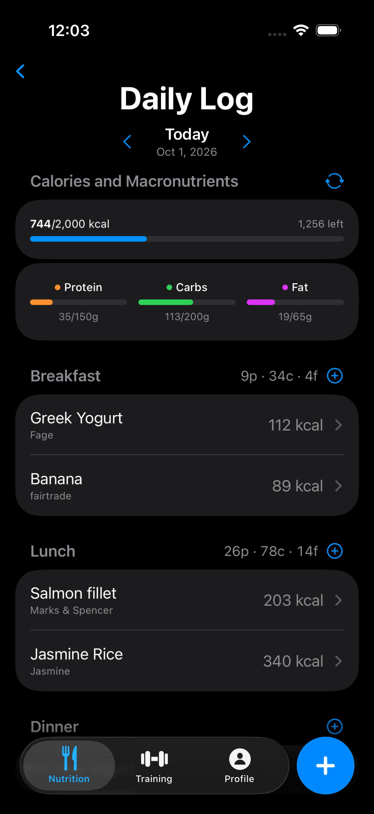
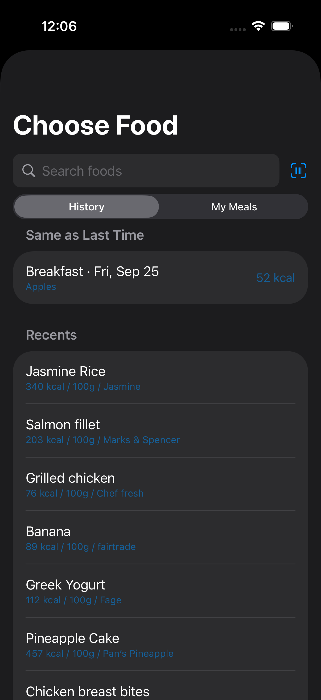
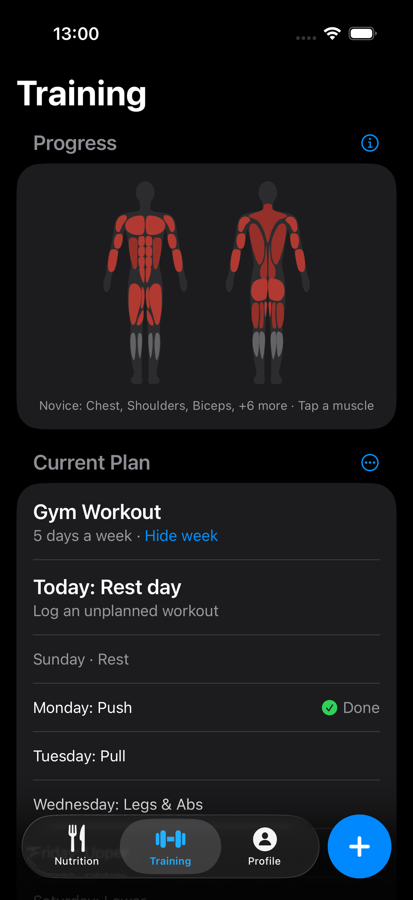
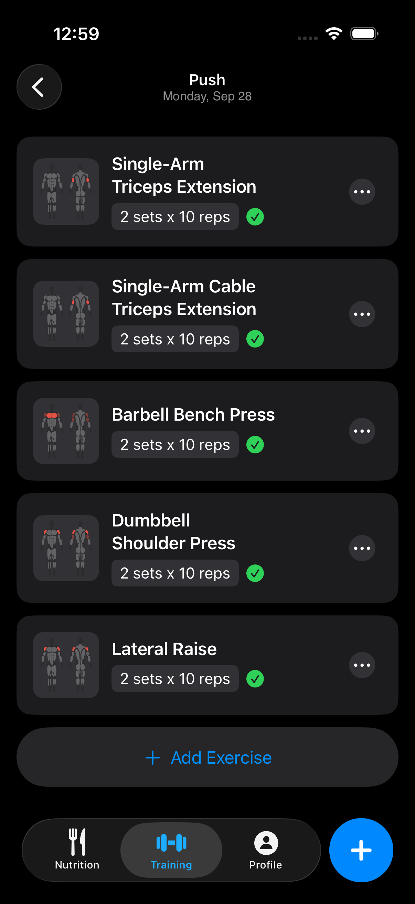
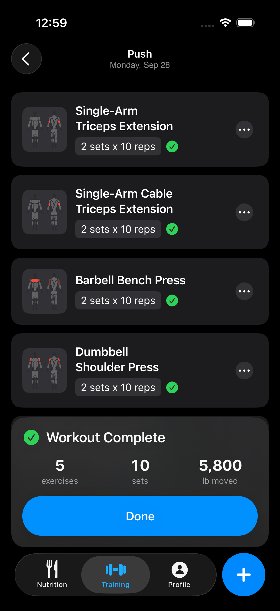

# MacroPal

**A native iOS macro/fitness tracker, built solo end-to-end as a self-directed usability case study, logging real dogfooding feedback and shipping fixes against it instead of just building features and moving on.**

**Tech Stack:** Swift, SwiftUI, SwiftData, Swift Charts, Open Food Facts API

---

## Market context

This started as a personal-use, learn-SwiftUI project, until I noticed things that could be
diagnosed: fitness apps increasingly gate basic tracking behind subscriptions (calorie/macro
goals, ad-free logging, barcode scans), and there's growing consumer skepticism toward opaque,
AI-generated health advice. Building a free, fully offline app, and choosing an explainable
rule-based recommendation engine over an LLM (below), ended up aligned with both.

## The problem

Most personal-project apps ship a feature once and never revisit whether it actually works for
the person using it. I wanted practice doing the part of the job that matters more than writing
the first version: using a real product daily, turning friction into a written record, deciding
what's worth fixing, and shipping a fix that closes the loop.

So alongside the app, I kept a running [usability log](docs/usability.md). Every session,
I wrote down what was annoying, why, and what "better" would look like. That log is the actual
deliverable this README is about; the app is where the recommendations get implemented.

## Diagnose → recommend → deliver: the food logging rework

**Diagnose.** Daily dogfooding surfaced a cluster of related complaints in the nutrition flow:
food entries could only be created manually (no search, no brands), serving sizes were
grams-only, a wrong entry couldn't be deleted, and the daily log/history views didn't scale as
entries accumulated. Individually these looked like small polish items; together they were the
single biggest source of everyday friction in the app. See the
[dislikes log](docs/usability.md#dislikes) for the raw entries.

**Recommend.** Rather than patching each complaint as an isolated ticket, I traced them to one
root cause (the food-entry pipeline had no connection to a real food database and no
edit/delete path) and scoped a single rework: integrate a real food search, support the units
people actually use, and make a logged entry editable instead of read-only.

**Deliver.** Integrated the [Open Food Facts](https://world.openfoodfacts.org/) search-a-licious
API for relevance-ranked search (bolded matches, brand names, capped results), added
Recents/My Foods tabs with swipe-to-delete, added a grams/ounces/named-serving unit picker, and
turned the food entry detail screen into an in-place editor, closing out multiple P1/P2 items
from the usability backlog in one coherent change instead of four disconnected ones.
(See [commit 1a3b380](https://github.com/FrancisLozano/MacroPal/commit/1a3b3803f039885b820fa0b3e22bc0589c2067d1).)

**Result, tracked:** of 13 dislikes and 7 suggestions logged during dogfooding, 3 have shipped
fixes and 12 are triaged into a prioritized backlog with an explicit P1/P2/P3 scale. See the
[snapshot table](docs/usability.md#snapshot). That table is a live number, not a one-time
count; it's meant to move.

**Next up:** the same diagnose → recommend → deliver pass, applied to Body tracking and Workout
progression — both currently flagged in the backlog as lacking visual clarity and taking too
long to log against.

## A deliberate architecture tradeoff: rules over an LLM

The app includes an analysis engine ("the coach") that reviews logged data and proactively
surfaces recommendations, e.g. "weight has been flat for 2 weeks on a deficit, consider a
150 kcal/day reduction." The obvious implementation is an LLM call. I chose a **deterministic,
rule-based engine** instead, and wrote down why rather than just picking one silently — see
[docs/phase-3-analysis-engine.md](docs/phase-3-analysis-engine.md):

- Every recommendation is explainable and reproducible — same data in, same insight out — which
  matters when the "advice" is about someone's health, and directly answers the trust concern
  noted above rather than adding another black-box output.
- Zero ongoing API cost and zero network dependency, keeping the app free and fully offline.
- Five rules shipped, each a small unit-tested `(historicalData) -> Insight?` function (weight
  plateau, protein under-eating, strength stall, missed-logging streak, goal-weight reached).

This isn't "avoided AI because it's hard": it's a documented tradeoff between explainability/cost
and narrative polish, made explicit in the spec instead of left implicit in the code.

## Screenshots

### Nutrition

<table>
  <tr>
    <td width="50%"></td>
    <td width="50%"></td>
  </tr>
  <tr>
    <td><b>Daily Log.</b> Calories against the day's target, protein / carbs / fat bars, and each meal's macros in its heading.</td>
    <td><b>Choose Food.</b> Open Food Facts search and barcode scanning, plus "Same as Last Time" and Recents for one-tap repeats.</td>
  </tr>
</table>

### Training

<table>
  <tr>
    <td width="33%"></td>
    <td width="33%"></td>
    <td width="33%"></td>
  </tr>
  <tr>
    <td><b>Progress.</b> A body map colored by each muscle's level from logged volume, above the week's plan.</td>
    <td><b>A workout day.</b> Every exercise in the day's plan, checked off as its sets are logged.</td>
    <td><b>Workout complete.</b> Exercises, sets and total weight moved, shown after the day's last exercise.</td>
  </tr>
</table>

## Project status

Core app (nutrition, body, workout tracking, and the rule-based analysis engine) is complete and
in daily personal use. Two phases were deliberately scoped out; both require paid API/developer
access, which conflicts with the goal of a free app with no ongoing cost:

- [x] Phase 0 — [Project setup](docs/phase-0-setup.md)
- [x] Phase 1 — [MVP manual tracking](docs/phase-1-mvp.md)
- [x] Phase 2 — [Trends & charts](docs/phase-2-trends.md)
- [x] Phase 3 — [Rule-based analysis engine](docs/phase-3-analysis-engine.md)
- [ ] Phase 4 — [LLM narrative layer](docs/phase-4-llm-layer.md) — skipped, requires a
      pay-per-use Claude API key
- [x] Phase 5 — [Stretch features](docs/phase-5-stretch.md) — free candidates (barcode
      scanning, home-screen widget) done; remaining candidates skipped, require a paid Apple
      Developer account

See [SPEC.md](SPEC.md) for the full vision, tech stack, and data model — it's a living document,
so `git log SPEC.md` doubles as a history of how the plan evolved and why.
